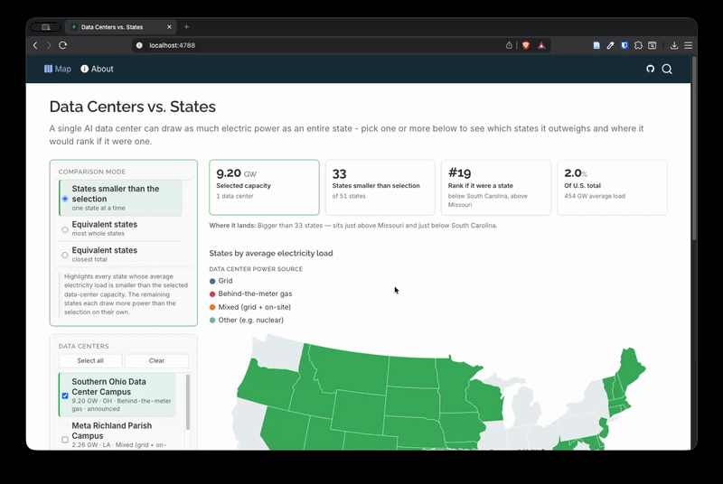

# datacenter-states

A static Quarto website that makes the scale of AI data center power demand
tangible: pick one or more data centers and see the map light up the set of
U.S. states whose combined average electricity draw equals that same power.

View it live at https://jhelvy.github.io/datacenter-states/



## What the app does

Announced data center capacities are quoted in gigawatts, a unit that means
very little on its own. The site converts each U.S. state's annual electricity
consumption into an average load in GW (annual MWh ÷ 8,760 h) so that state
power draw and data center capacity are directly comparable, then answers the
question "how much of the country does this data center draw?" visually.

Pick any combination of data centers from the sidebar. The map, the KPI
figures, and the treemap all update together to show the states that match the
selected capacity.

### The three comparisons

The sidebar's mode selector chooses how states are matched against the selected
data center capacity:

1. **States smaller than the selection** (`smaller`) — a threshold filter. Every
   state whose average load is *less* than the selected capacity is highlighted;
   the rest each draw more power than the selection on their own. This is the
   quickest read on where a single data center sits in the distribution.
2. **Equivalent states, most whole states** (`smallest`) — adds up whole states
   starting from the smallest electricity consumer and keeps going until their
   combined average load reaches the selected capacity. Answers "how many of the
   least power-hungry states does it take to equal this?"
3. **Equivalent states, closest total** (`closest`) — searches combinations of
   states for the subset whose combined average load lands closest to the
   selected capacity. Answers "which handful of states, taken together, draws
   almost exactly this much?"

Modes 2 and 3 are subset-sum problems solved in the browser; mode 1 needs no
search at all.

## Repository layout

- `R/` — data pipeline (EIA state power, map geometry, data center prep)
- `data/` — raw and processed datasets; see `data/README.md` for sources
- `index.qmd` (map/landing page) / `about.qmd` — the Quarto site pages
- `tests/testthat/` — tests for the R data pipeline

See `plan.md` for the implementation plan.

## Running the site locally

The site is plain Quarto with no server component, so a local Quarto install is
all that is needed. `data/processed/` is committed, so you do not have to run R
to preview the site.

```sh
# Live-reloading preview at http://localhost:4200
quarto preview

# One-off build into _site/
quarto render
```

To rebuild the data (only needed when `data/raw/` changes), run the R pipeline
first and commit the regenerated files:

```sh
Rscript -e 'source("R/build_data.R")'
Rscript -e 'testthat::test_dir("tests/testthat")'
```

## Deploying

Pushing to `main` triggers `.github/workflows/publish.yml`, which renders the
site with Quarto and publishes `_site/` to the `gh-pages` branch. GitHub Pages
serves that branch from its root.

CI runs Quarto only — it does not run R, because the pages contain no R chunks
and read their data from the committed files in `data/processed/`. When the
underlying data changes, run `source("R/build_data.R")` locally and commit the
regenerated `data/processed/` files along with your other changes.
